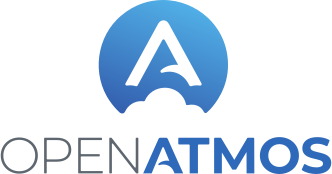

# Continuous Integration with research notebooks: on maintaining reproducibility in atmospheric modeling

**Authors**:  [Agnieszka Żaba](mailto:azaba@agh.edu.pl), [Sylwester Arabas](mailto:sylwester.arabas@agh.edu.pl), [`open-atmos` contributors](https://github.com/open-atmos)

**Abstract**:

The maintenance of research-result reproducibility can support rather than be a challenge of ongoing project development.
The integration of research notebooks with automated software testing workflows is an essential prerequisite for this. 
We present reusable tools and solutions engineered in the development and maintenance of the [PySDM](https://open-atmos.github.io/PySDM) and [PyMPDATA](https://open-atmos.github.io/PyMPDATA) atmospheric modeling projects.
Both packages are developed entirely in Python, using just-in-time compilation tools (Numba \& NVRTC) to enable a single-language HPC tech stack that covers simulation, analysis, and visualization codes.
We will discuss the perspectives of both user and developer on reproducibility.

From the user's perspective, maintenance of notebooks that reproduce paper results using up-to-date project codebase serves the purpose of documenting and exemplifying project features and applications. 
It enables exploratory usage with little-to-no effort needed to set up a working environment.
However, this is contingent on a design embracing modularity and inversion of control - it is not uncommon in atmospheric modeling for papers to use different simulation flow control or different parameterizations.
We present the inversion of control solutions from PySDM that enable the choice of formulae and constants from user code, without trade-offs in: \
    (i) performance, \
    (ii) ability to switch between CPU and GPU backends, and \
    (iii) dimensional analysis of physics-relevant routines for testing unit correctness.\
The maintenance of notebooks within code repositories also poses challenges in terms of handling embedded visuals.
The [open-atmos-jupyter-utils](https://pypi.io/p/open-atmos-jupyter-utils) project helps with embedding GitHub-renderable and Jupyter-book-compatible vector graphics and animations.

From the developer's perspective, notebooks within the code repository are a source of test scenarios and constraints for the assertions that constitute a robust regression-test suite.
We present the notebook\_vars() function from the jupyter-utils package, designed to be used in concert with the fixture logic of the pytest framework.
It enables the execution of the notebook code once in a test session, allowing us of  the final notebook state in multiple automated tests. This occurs without modifications to the notebooks themselves.
In notebooks pertaining to specific research studies, a direct link from test code up to subject literature is provided.
Overall, we achieve an improvement in code readability and refactoring capability.

The presented solutions, along with the availability of platforms such as Google Colab, mybinder.org or institutional Jupyter hubs, ensure single-click 
reproducibility of research-paper results, and a structure for retaining this through future releases of the code base.
In addition to the benefits for software users and developers, this satisfies the scientific-method and research-journal reproducibility requirements.

**Keywords:** jupyter-notebooks, reproducibility, CI, atmospheric-science

**Acknowledgements**: 

`open-atmos` community:\

NCAR Mesoscale and Microscale Meteorology:\

AGH University of Krakow, Poland (IDUB):\

SEA Improving Scientific Conference:\

National Science Centre Poland:\

---

