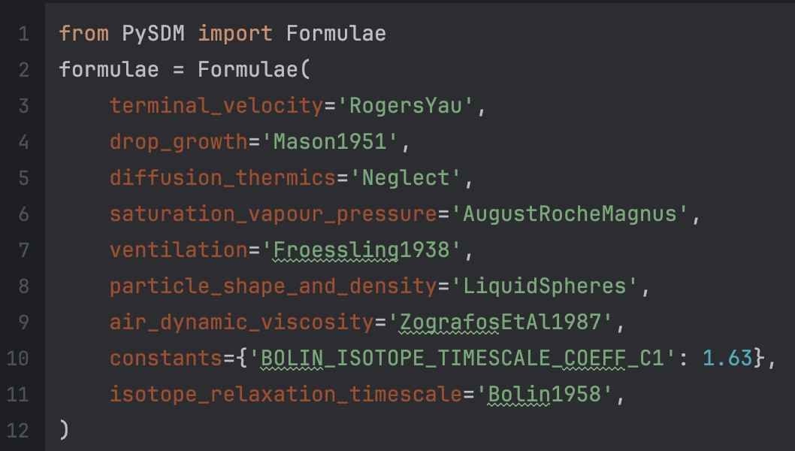
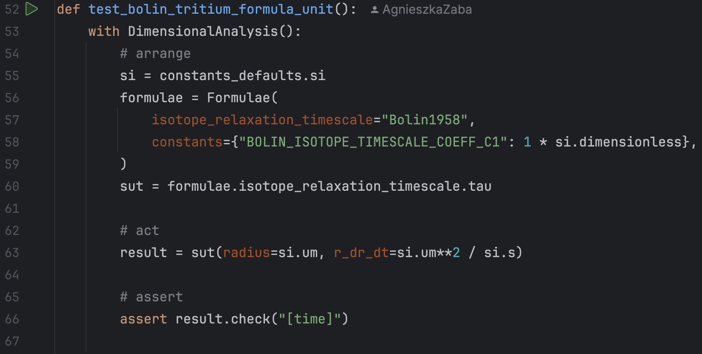

# Developers' perspective            

## What is special about atmospheric science? 

[](https://github.com/open-atmos/jupyter-utils)

It is not uncommon in atmospheric modeling for papers to use different simulation flow control or different parameterizations.
We present the inversion of control solutions from PySDM that enable the choice of formulae and constants from user code, without trade-offs in:
- performance,
- ability to switch between CPU and GPU backends, and
- dimensional analysis of physics-relevant routines for testing unit correctness.
    

```{admonition} Inversion of Control
Prerequisite for reusability in atmospheric science and for testing
```




```{admonition} Take-home message
Formulae and Constants chosen by User --- Modularity and Inversion of Control 

Help with on-boarding new developers 
```


## Dimensional analysis

Due to modularity inside repository there is a feasibility to engineer dimensional analysis of the code that can be switched on for testing, and switched off by default



```{admonition} Take-home message
Modularity and Inversion of Control help with dimensional analysis!
```

## Notebooks are a source of test (edge) cases!

**`open-atmos-jupyter-utils`**
A Python package providing Jupyter notebook utility routines 
for:
- presenting [matplotlib](https://matplotlib.org) plots as either SVG vector graphics or animated GIFs, embedding them within the notebooks, and rendering correctly in [GitHub's Rich Jupyter Notebook diffs](https://github.blog/changelog/2023-03-01-feature-preview-rich-jupyter-notebook-diffs/)
- save-as buttons below each figure (triggering [Google-Drive downloads](https://colab.research.google.com/notebooks/io.ipynb#scrollTo=hauvGV4hV-Mh) on [Colab](https://colab.google/))
- execution of unmodified notebook code for automated testing (e.g., within [pytest fixtures](https://docs.pytest.org/en/stable/explanation/fixtures.html))
- pip-installation of external packages on Colab safeguarded against [alterations of Google-shipped packages](https://github.com/googlecolab/colabtools/issues/2837)

Can be installed via `pip`
[](https://pypi.org/project/open-atmos-jupyter-utils)
[](https://github.com/open-atmos/jupyter-utils)

```
pip install open-atmos-jupyter-utils
```


### **`notebook_vars()`**
- executes unmodified notebook code for automated testing
- run-once with multiple asserts (using pytest fixture)

```{admonition} Take-home message
Research notebooks are a source of test cases --- physical model, paper results, etc.
```

```{admonition} Take-home message
Using pytest fixture unit tests are outside the notebooks!
```

Show example is based on {cite:p}`bolin_use_1958` [](https://github.com/open-atmos/PySDM/blob/main/examples/PySDM_examples/Bolin_1958/table_1.ipynb).


---
## DEMO
<video width=320 height=240  controls>
  <source src="../_static/1_devs.mp4" type="video/mp4">
Your browser does not support the video tag.
</video>